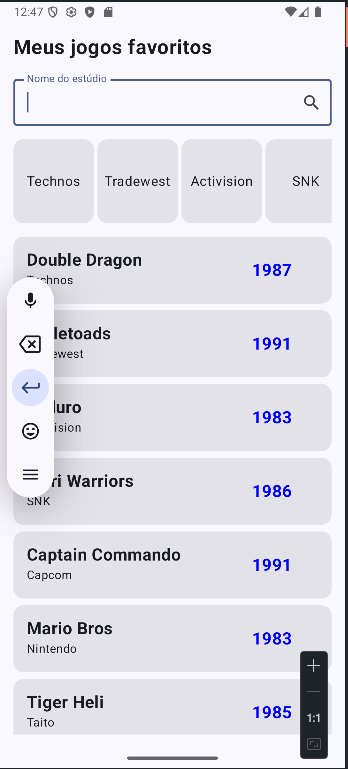
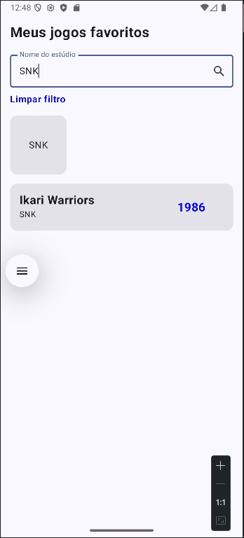
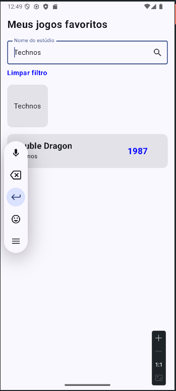

# Projeto Fundamentos de Jetpack Compose: Listas e Filtros

Este é um projeto acadêmico para a disciplina de desenvolvimento mobile, focado em demonstrar os conceitos fundamentais do Jetpack Compose, a moderna toolkit de UI do Android. O aplicativo exibe uma lista de jogos e seus respectivos estúdios, permitindo a filtragem dinâmica dos dados.

## Integrantes da Equipe

- Nome: Caio Sales - RM:552286
- Nome:Cintia Cristina Braga Angelo - RM:552253
- Nome: Guilherme Bussolan - RM:552455
- Nome: Henrique Mosseri - RM:552240


##  Estrutura do Projeto
```
app/
 └── src/
     └── main/
         └── java/
             └── M1nks2/com/github/listas-lazy-old-games-jetpack-compose/
                 ├── MainActivity.kt         # Ponto de entrada. Apenas hospeda a tela.
                 │
                 ├── data/                   # Camada de Dados (antes 'repository')
                 │   ├── model/
                 │   │   └── Game.kt           # Modelos de dados (Studio, Game)
                 │   └── repository/
                 │       └── GameRepository.kt # Fornece os dados (de API, BD ou estático)
                 │
                 └── ui/                     # Camada de UI (Tudo relacionado à interface)
                     ├── theme/              # Arquivos de tema (Color.kt, Theme.kt, etc.)
                     │
                     └── games/              # Pacote por funcionalidade: tela de jogos
                         ├── GamesScreen.kt      # O Composable da tela, agora sem lógica de estado.
                         ├── GamesViewModel.kt   # NOVO: Gerencia o estado e a lógica da tela.
                         └── components/
                             ├── GameCard.kt       # Componente reutilizável para o card de jogo.
                             └── StudioCard.kt 
```

## Funcionalidades Implementadas

-   **Listagem de Estúdios:** Exibição de uma lista horizontal (`LazyRow`) com os estúdios de desenvolvimento.
-   **Listagem de Jogos:** Exibição de uma lista vertical (`LazyColumn`) com os jogos.
-   **Filtro por Texto:** Um campo de texto permite ao usuário buscar jogos por nome ou por estúdio.
-   **Filtro por Clique:** Ao clicar em um card de estúdio na lista horizontal, a lista de jogos é automaticamente filtrada para exibir apenas os jogos daquele estúdio.
-   **Limpar Filtro:** Um botão de texto ("Limpar filtro") aparece sempre que um filtro está ativo, permitindo ao usuário retornar à lista completa com um único clique.

## Telas (Screenshots)

**Instrução:** Tire prints da sua aplicação e substitua os links abaixo. Você pode arrastar as imagens para a área de edição do `README.md` no site do GitHub que ele gera o link para você.

#### Tela Principal (Sem Filtro)


#### Tela com Filtro por Texto


#### Tela com Filtro por Clique no Estúdio


## Tecnologias Utilizadas

-   **Linguagem:** Kotlin
-   **Toolkit de UI:** Jetpack Compose
-   **Arquitetura:** MV (Model-View) simples para fins didáticos
-   **IDE:** Android Studio

## Como funciona

- A tela principal exibe uma lista de jogos e uma lista horizontal de estúdios.
- O usuário pode filtrar os jogos digitando o nome do estúdio ou clicando em um StudioCard.
- O filtro pode ser limpo facilmente com o botão "Limpar filtro".

## Como rodar o projeto

1. Clone este repositório:
   ```sh
   git clone <url-do-repositorio>
   ```
2. Abra o projeto no Android Studio.
3. Execute em um emulador ou dispositivo físico Android.


---


